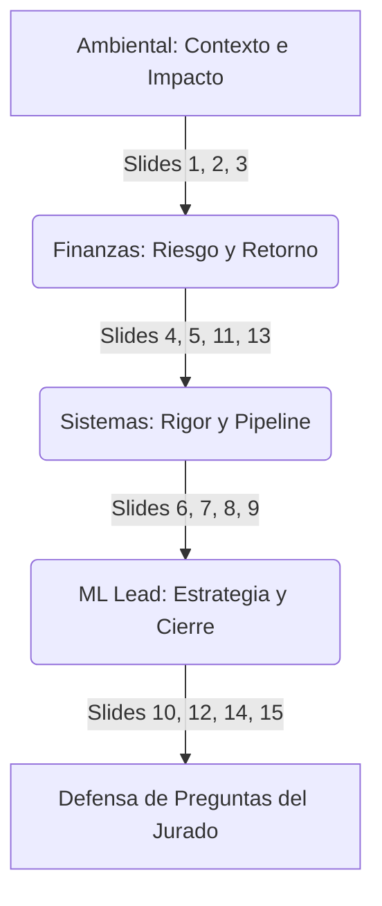

# 🎤 GUION DE EXPOSICIÓN — EQUIPO ARMONITECH
## 🏆 Estrategia de Defensa para el Datathon ESAN 2026 | FinanCrece S.A.

Este documento contiene la distribución óptima y los discursos paso a paso para defender la presentación **GRUPOArmonitech_MEJORADO.pptx** ante el jurado de la Datathon ESAN 2026. 

---

## 👥 DISTRIBUCIÓN ESTRATÉGICA DE LA EXPOSICIÓN

Para maximizar el impacto y proyectar un equipo multidisciplinario altamente profesional, dividiremos las **15 diapositivas** de la siguiente manera:



### 📋 Resumen de Asignaciones

| Expositor(a) | Perfil | Diapositivas | Foco Discursivo |
|---|---|---|---|
| **Compañera Ambiental** | *Narradora & Impacto Humano* | **Slides 1, 2 y 3** | Apertura, empatía, contexto del problema y motivaciones humanas (EDA inicial). |
| **Compañera de Finanzas** | *Experta en Riesgo & Negocio* | **Slides 4, 5, 11 y 13** | Análisis socioeconómico tradicional, retorno de inversión (ROI), Basilea II y provisiones. |
| **Compañera de Sistemas** | *Ingeniería & Modelado Técnico* | **Slides 6, 7, 8 y 9** | Rigor técnico, pipeline de machine learning, comparativa de modelos, feature engineering y matemática del riesgo. |
| **Tú (ML / Technical Lead)** | *Estrategia Analítica & Cierre* | **Slides 10, 12, 14 y 15** | Inclusión financiera responsable, la herramienta de política de 3 bandas, explicabilidad avanzada (SHAP) y plan de acción. |

---

# 🎙️ GUIONES DETALLADOS PASO A PASO

---

## 👩‍🌾 EXPOSITOR 1: COMPAÑERA AMBIENTAL
**Foco:** Narrativa, empatía, contexto de negocio y análisis de propósitos de crédito.
**Tono:** Seguro, elocuente, centrado en el impacto y la realidad del cliente.

---

### 🛝 SLIDE 1 — Portada y Apertura (0:00 - 0:45)
* **Visual:** Portada limpia con los nombres del equipo Armonitech.

#### 💬 Discurso del Expositor:
> *"Muy buenas tardes, distinguidos miembros del jurado. Somos el equipo **Armonitech** y hoy venimos a presentarles una solución integral y analítica para un desafío crítico en **FinanCrece S.A.**: la optimización de nuestro sistema de Scoring de Crédito. Nuestra filosofía se resume en una frase: 'Predecir el riesgo antes del desembolso es la diferencia entre la rentabilidad y la mora'. En los próximos minutos, les mostraremos cómo transformamos datos complejos en decisiones automatizadas de alto retorno financiero y social."*

---

### 🛝 SLIDE 2 — El Problema: ¿Por qué el crédito falla? (0:45 - 1:45)
* **Visual:** Diapositiva que muestra el aumento de la mora de 4.2% a 7.8% en 18 meses.
* **Gráfico a explicar:** `eda_target_y_checking.png`

#### 💬 Discurso del Expositor:
> *"El punto de partida es preocupante: la mora de FinanCrece se ha casi duplicado, pasando de un saludable **4.2% a un alarmante 7.8%** en solo 18 meses. Esto no es casualidad; responde a la falta de herramientas predictivas robustas antes de entregar el dinero. 
> Al analizar los datos reales, descubrimos señales de alerta tempranas contundentes. Por ejemplo, los clientes con una **cuenta corriente en negativo** presentan un **47.4% de tasa de default (incumplimiento)**, mientras que aquellos con empleo menor a un año llegan al **40.4%** de mora. 
> Esto nos demuestra que el incumplimiento no es aleatorio; es predecible si sabemos leer las señales correctas."*

#### 📊 Guía de Explicación del Gráfico (`eda_target_y_checking.png`):
1. **Qué señalar:** Dirige la mirada del jurado hacia el gráfico de barras que analiza el estado de la cuenta corriente (`checking_status`).
2. **Qué decir:** *"Como pueden observar en este gráfico de barras de nuestro Análisis Exploratorio de Datos (EDA), el grupo con saldo negativo (barra roja de la izquierda) tiene una probabilidad de default de casi el 50%. En contraste, la barra de la derecha muestra a los clientes que no tienen cuenta corriente registrada o tienen saldos estables, donde la mora cae drásticamente a un 10.9%. Esta sola variable ya separa de manera contundente el riesgo alto del riesgo bajo."*

---

### 🛝 SLIDE 3 — ¿Quién solicita un crédito y para qué? (1:45 - 2:45)
* **Visual:** Tabla de propósitos comunes y tasa de default asociada.
* **Gráfico a explicar:** `ppt_proposito_vs_default.png`

#### 💬 Discurso del Expositor:
> *"Para entender el problema, debemos preguntarnos: ¿Para qué nos piden dinero? Analizamos a **800 clientes históricos**, donde la tasa de default global promedio es del **29.5%**. 
> Descubrimos que el propósito del crédito es un predictor de comportamiento espectacular. Sorprendentemente, los créditos destinados a **Radio o Televisión** y a **Auto Usado** son los de menor riesgo, con solo **21.8%** y **15.4%** de default respectivamente. 
> Por otro lado, los créditos para **Educación** y **Nuevos Negocios** representan las tasas de mora más altas, alcanzando el **40.5%** y **38.2%**. Esto nos enseña que el destino del dinero debe modular nuestras exigencias de garantías."*

#### 📊 Guía de Explicación del Gráfico (`ppt_proposito_vs_default.png`):
1. **Qué señalar:** Enfócate en el gráfico de barras horizontales ordenadas de menor a mayor riesgo por propósito.
2. **Qué decir:** *"Este gráfico ilustra claramente la disparidad del riesgo por propósito. Noten cómo adquirir un bien de entretenimiento como una Radio o TV (arriba) muestra barras con muy bajo default. Esto ocurre porque suelen ser montos pequeños y cuotas manejables. Sin embargo, financiar un proyecto educativo o un negocio (abajo) dispara el riesgo. ¿Por qué? Porque son inversiones de retorno incierto a largo plazo. Nuestra recomendación inmediata es aprobar consumo con flujos rápidos y exigir mayores garantías o co-deudores para educación y negocios."*

> **Transición hacia Expositor 2:** 
> *"Pero el propósito no lo es todo; el perfil socioeconómico y la estabilidad patrimonial del cliente completan esta ecuación. Para profundizar en estas variables financieras y de comportamiento, los dejo con mi compañera de Finanzas."*

---

## 👩‍💼 EXPOSITOR 2: COMPAÑERA DE FINANZAS
**Foco:** Estabilidad del cliente, colateral patrimonial, retorno financiero (ROI) del modelo y Basilea II.
**Tono:** Analítico, corporativo, riguroso en números y enfocado en rentabilidad.

---

### 🛝 SLIDE 4 — Empleo y Estado Civil: ¿Quién paga a tiempo? (2:45 - 3:45)
* **Visual:** Layout de dos columnas: Empleo y Estado Civil.
* **Gráficos a explicar:** `ppt_empleo_tiempo_vs_default.png` (Principal) y miniatura de `ppt_estado_civil_vs_default.png`

#### 💬 Discurso del Expositor:
> *"Muchas gracias. Desde la perspectiva del análisis de riesgo tradicional, el empleo y el estado civil nos dan una proxy directa de la estabilidad del flujo de caja del solicitante. 
> Nuestro modelo identificó que el **tiempo de empleo ideal** para minimizar la mora está entre los **4 y 7 años**, donde la tasa de default cae a un óptimo de **21.4%**. Los clientes con menos de un año de empleo representan el máximo riesgo con **40.4%** de mora. 
> En cuanto al estado civil, vemos una clara diferencia de comportamiento: los hombres casados o viudos registran la mora más baja del portafolio con un **24.7%**, mientras que las mujeres solteras, divorciadas o casadas (registradas de forma conjunta) y hombres divorciados muestran tasas superiores al **36%**. La estabilidad domiciliaria y de estado civil mitiga el riesgo de fuga."*

#### 📊 Guía de Explicación de los Gráficos:
1. **Qué señalar:** El gráfico de líneas de años de empleo y el gráfico de barras de estado civil.
2. **Qué decir:** *"Si observan el gráfico de empleo (`ppt_empleo_tiempo_vs_default.png`), vemos una curva en forma de 'U' donde el punto más seguro es el rango de 4 a 7 años. Los recién contratados (extremo izquierdo) son altamente inestables financieramente. Por el lado del estado civil (`ppt_estado_civil_vs_default.png`), confirmamos una diferencia de **11 puntos porcentuales** de riesgo entre un hombre casado y un cliente divorciado. El modelo utiliza estas interacciones para afinar la probabilidad de default."*

---

### 🛝 SLIDE 5 — Vivienda: ¿Propia o Alquilada? (3:45 - 4:45)
* **Visual:** Comparativa de mora por tipo de tenencia de vivienda.
* **Gráfico a explicar:** `ppt_vivienda_vs_default.png`

#### 💬 Discurso del Expositor:
> *"Hablemos de garantías morales y patrimoniales: la vivienda. Este es uno de los hallazgos más potentes para el diseño de nuestras políticas de crédito. 
> El **71.4%** de nuestra cartera cuenta con **vivienda propia**, y este segmento registra una tasa de default de **25.6%**. En contraste, los inquilinos (alquilada) y aquellos que viven en viviendas cedidas o de familiares ('for free') disparan su mora hasta el **39.0%** y **39.8%** respectivamente. 
> Una diferencia abismal de **14 a 15 puntos porcentuales**. Para el banco, la vivienda propia actúa como un ancla patrimonial y un colateral implícito: el cliente tiene demasiado que perder y su arraigo domiciliario reduce la probabilidad de incumplimiento."*

#### 📊 Guía de Explicación del Gráfico (`ppt_vivienda_vs_default.png`):
1. **Qué señalar:** El gráfico circular y las barras comparativas de vivienda.
2. **Qué decir:** *"Este gráfico muestra la distribución del portafolio. El gran bloque verde representa la vivienda propia, que es la zona segura del banco. Las barras rojas a la derecha de vivienda alquilada y cedida muestran claramente el incremento del riesgo. Financieramente, esto nos indica que la tenencia de vivienda propia debe ser ponderada positivamente en las políticas de límites de crédito y tasas."*

---

### 🛝 SLIDE 11 — Gini → Dinero: ¿Cuánto ahorra el modelo? (4:45 - 5:45)
* **Visual:** Matriz de costos económica y ROI calculado.
* **Gráfico a explicar:** `ppt_gini_dinero.png`

#### 💬 Discurso del Expositor:
> *"Ahora, traduzcamos la estadística en dinero, que es lo que le interesa a la alta gerencia. Un indicador Gini alto es inútil si no genera valor. Para ello, aplicamos una **matriz de costo-beneficio bajo un escenario supuesto [SUPUESTO]**:
> - Aprobar a un buen pagador nos genera un beneficio neto de **+$450 USD**.
> - Aprobar a un cliente que cae en default nos genera una pérdida de **-$3,000 USD** (por costos de cobranza judicial y pérdida de capital).
> - Rechazar a un cliente (costo de oportunidad/evaluación) nos cuesta **-$150 USD**.
> Si aprobáramos a todos los solicitantes a ciegas, FinanCrece perdería un neto de **-$90,150 USD** debido a la alta mora. Al aplicar nuestro modelo de Machine Learning y la política que detallaremos adelante, evitamos el **44%** de los defaults, lo que genera un ahorro de **$96,600 USD [SUPUESTO]**. Esto representa un **ROI de +107%** comparado con la política base de aprobación total. El modelo se paga solo en el primer lote de evaluación."*

#### 📊 Guía de Explicación del Gráfico (`ppt_gini_dinero.png`):
1. **Qué señalar:** La curva de ahorro acumulado y el punto de máxima rentabilidad económica.
2. **Qué decir:** *"En este gráfico de optimización financiera (`ppt_gini_dinero.png`), el eje Y muestra la utilidad del banco y el eje X los umbrales de score. La línea punteada roja representa la pérdida de aprobar a todos. Vean cómo la curva azul asciende hasta encontrar una zona de máxima utilidad. Este punto óptimo nos permite capturar el mayor volumen de clientes buenos al tiempo que bloqueamos a los malos, maximizando el valor económico para FinanCrece."*

---

### 🛝 SLIDE 13 — Pérdida Esperada y Provisiones (Marco Basilea II) (5:45 - 6:45)
* **Visual:** Ecuación de Pérdida Esperada y su impacto en capital regulatorio.
* **Gráfico a explicar:** `roi_politica_final.png`

#### 💬 Discurso del Expositor:
> *"Como entidad financiera regulada, debemos alinearnos a las mejores prácticas y al marco de **Basilea II**. La fórmula fundamental para calcular las provisiones de riesgo de crédito es:
> $$\text{Pérdida Esperada (EL)} = \text{PD} \times \text{EAD} \times \text{LGD}$$
> Donde nuestro modelo de Machine Learning es el encargado de proveer la **PD (Probabilidad de Default)** de manera exacta para cada cliente. La **EAD (Monto Expuesto)** equivale al `credit_amount` solicitado y estimamos una **LGD (Pérdida dado el Incumplimiento) del 100% [SUPUESTO]**. 
> Por ejemplo, para un crédito de $3,000 USD con un cliente de riesgo alto (PD de 65%), la Pérdida Esperada es de **$1,950 USD**, dinero que el banco debe provisionar de inmediato, congelando su capital. Nuestro modelo permite hacer provisiones dinámicas e individualizadas: reducimos las provisiones en la banda de bajo riesgo, liberando capital de trabajo para que FinanCrece pueda colocar más créditos de manera segura."*

#### 📊 Guía de Explicación del Gráfico (`roi_politica_final.png`):
1. **Qué señalar:** El panel de distribución del portafolio por bandas y la Pérdida Esperada asociada.
2. **Qué decir:** *"Este panel resume cómo segmentamos la cartera. Observen que al separar a los clientes por su PD predictiva (barras verdes, amarillas y rojas), el banco puede estimar exactamente cuánta provisión requiere cada banda. En lugar de provisionar de forma genérica a todos los clientes, provisionamos el 59.4% del capital de la banda alta y solo el 8.9% de la banda baja. Esto es eficiencia de capital pura bajo estándares de Basilea."*

> **Transición hacia Expositor 3:**
> *"Pero, ¿cómo logramos este nivel de precisión matemática en la predicción de la PD? Para explicar el riguroso desarrollo técnico del pipeline de datos y la arquitectura del modelo, le doy el pase a mi compañera de Sistemas."*

---

## 👩‍💼 EXPOSITOR 3: COMPAÑERA DE SISTEMAS
**Foco:** Rigor técnico, Feature Engineering, arquitectura de modelos, métricas y no-linealidad de variables.
**Tono:** Técnico, estructurado, preciso y seguro en términos de ingeniería de datos.

---

### 🛝 SLIDE 6 — Los Datos y el Pipeline de Machine Learning (6:45 - 7:45)
* **Visual:** Diagrama del pipeline y tabla comparativa de modelos (LR vs RF vs LightGBM).
* **Gráfico a explicar:** `panel_evaluacion_final.png`

#### 💬 Discurso del Expositor:
> *"Muchas gracias. Para construir una solución escalable y libre de sesgos, diseñamos un pipeline completo de Machine Learning extremo a extremo. 
> Partimos de un dataset de **800 clientes históricos con 20 variables brutas**. El primer paso crítico fue aplicar **Feature Engineering bancario**, expandiendo el espacio de características a **62 variables enriquecidas**, capturando interacciones no lineales de riesgo. 
> Para evitar cualquier tipo de fuga de información (data leakage), implementamos una estrategia de **Split Estratificado 60/20/20** (Entrenamiento, Validación y Test). 
> Evaluamos múltiples algoritmos bajo métricas estandarizadas de la industria. Nuestra **Regresión Logística** base logró un AUC de 0.783, **Random Forest** subió a 0.812, y nuestro modelo campeón, un **LightGBM altamente regularizado**, alcanzó un **AUC espectacular de 0.833, un Gini de 0.665 y un Kolmogorov-Smirnov (KS) de 0.633** en el set de prueba ciego."*

#### 📊 Guía de Explicación del Gráfico (`panel_evaluacion_final.png`):
1. **Qué señalar:** Las curvas ROC, la curva de Lift acumulada y la matriz de confusión.
2. **Qué decir:** *"En este panel de evaluación técnica (`panel_evaluacion_final.png`), quiero destacar dos gráficos. A la izquierda, la curva ROC (azul) muestra una separación muy cercana al ideal, sosteniendo un AUC de 0.833. A la derecha, el gráfico de Lift acumulado nos dice que si tomamos al 10% de los clientes clasificados con mayor riesgo por el modelo, capturamos **2.34 veces más defaults** que una selección aleatoria. Esto demuestra la altísima capacidad de discriminación del LightGBM."*

---

### 🛝 SLIDE 7 — ¿Qué variables predicen el default? (Feature Importance) (7:45 - 8:45)
* **Visual:** Top 10 variables predictoras y su rol.
* **Gráfico a explicar:** `ppt_feature_importance_jurado.png`

#### 💬 Discurso del Expositor:
> *"Un modelo no puede ser una caja negra. Por ello, extrajimos la importancia global de las variables para el jurado. 
> El principal predictor del modelo es nuestro **score_riesgo_compuesto**, un índice propio que creamos al fusionar el estado de la cuenta corriente, el historial de créditos anteriores, el nivel de ahorros y la estabilidad laboral. 
> Las siguientes variables clave son la **cuota_estimada** (monto mensual de pago) y la **carga_vs_cuenta** (la presión financiera frente a sus recursos). También destaca la **edad**, donde detectamos que clientes jóvenes con montos de crédito altos correlacionan fuertemente con la mora. La ingeniería de variables fue el factor clave para superar el 83% de AUC."*

#### 📊 Guía de Explicación del Gráfico (`ppt_feature_importance_jurado.png`):
1. **Qué señalar:** El gráfico de barras horizontales del Feature Importance.
2. **Qué decir:** *"En este gráfico (`ppt_feature_importance_jurado.png`), pueden ver la ponderación que el LightGBM otorga a cada variable. Noten cómo las variables sintéticas que creamos mediante Feature Engineering (representadas por las tres barras superiores) superan por mucho a las variables originales en crudo. Esto demuestra que agregar conocimiento experto de banca al diseño de variables enriquece la capacidad del algoritmo mucho más que usar los datos tal como vienen."*

---

### 🛝 SLIDE 8 — Monto, Plazo y Cuota: La Tríada del Riesgo (8:45 - 9:45)
* **Visual:** Interacción de monto, plazos y la linealidad de la cuota.
* **Gráficos a explicar:** `ppt_monto_duracion_riesgo.png` y `ppt_cuota_comprometida.png`

#### 💬 Discurso del Expositor:
> *"Uno de los análisis de ingeniería financiera más reveladores fue estudiar la relación entre el monto solicitado, el plazo del crédito y la cuota mensual resultante. 
> Al multiplicar el monto por el plazo, creamos la métrica de **Carga Financiera**. Al segmentarla en cuartiles, el cuartil 1 (carga baja) presenta una mora de **21.4%**, pero el cuartil 4 (carga alta) se dispara al **39.2%**, un incremento de **17.8 puntos porcentuales**. Plazos mayores a 24 meses son detonantes automáticos de riesgo. 
> Asimismo, evaluamos el porcentaje del ingreso del cliente comprometido a la cuota mensual. Esta relación es casi lineal: la mora en la cuota más baja (nivel 1) es de **23.4%** y asciende de manera constante hasta un **32.8%** en la cuota más alta (nivel 4). A mayor presión sobre el presupuesto mensual del cliente, menor capacidad de resistir shocks económicos."*

#### 📊 Guía de Explicación de los Gráficos:
1. **Qué señalar:** El mapa de calor de monto/plazo (`ppt_monto_duracion_riesgo.png`) y las barras de la cuota (`ppt_cuota_comprometida.png`).
2. **Qué decir:** *"El gráfico de la izquierda (`ppt_monto_duracion_riesgo.png`) nos muestra claramente cómo el riesgo se concentra en la esquina superior derecha (altos montos y largos plazos), donde la densidad de clientes en default (puntos rojos) es máxima. A la derecha, el gráfico de barras de cuota comprometida (`ppt_cuota_comprometida.png`) nos dibuja una pendiente casi lineal: a medida que subimos del nivel 1 al 4 de carga sobre el ingreso, la mora sube escalón por escalón. El modelo captura esta estructura lineal perfectamente."*

---

### 🛝 SLIDE 9 — Ahorros: ¿Lineal o No-Lineal? (9:45 - 10:45)
* **Visual:** Tasa de default por rangos de ahorro e identificación del umbral crítico.
* **Gráfico a explicar:** `ppt_ahorros_linealidad.png`

#### 💬 Discurso del Expositor:
> *"A diferencia de la cuota comprometida, la variable de **Ahorros** nos entregó un comportamiento completamente distinto: **es no-lineal y funciona como un umbral**. 
> Si evaluamos a clientes con ahorros menores a 100 USD (básicamente sin ahorros) o entre 100 y 500 USD, la mora se mantiene congelada en un altísimo **35.3%** y **35.1%**. No hay mejora alguna por tener 'un poquito' de ahorros. 
> Sin embargo, al cruzar la frontera de los **500 USD**, la tasa de default sufre una **caída abrupta e histórica al 19.6%**, y si el cliente supera los 1,000 USD, cae a solo **12.2%**. 
> Esto nos indica que el ahorro de los clientes no mitiga el riesgo de manera continua; actúa como un amortiguador de liquidez ('buffer') que solo es efectivo cuando supera un tamaño crítico de **500 USD**. Este es un insumo clave para las políticas de admisión del banco."*

#### 📊 Guía de Explicación del Gráfico (`ppt_ahorros_linealidad.png`):
1. **Qué señalar:** El punto de inflexión o 'codo' en la gráfica de ahorros.
2. **Qué decir:** *"Este gráfico (`ppt_ahorros_linealidad.png`) representa perfectamente la no-linealidad. Vean las dos primeras barras rojas de la izquierda: el riesgo es plano. De repente, al llegar a la barra de 500 USD, vemos una caída abrupta (el escalón). Para un modelo lineal tradicional, esta relación es muy difícil de modelar adecuadamente, pero nuestro LightGBM basado en árboles de decisión la detecta y aprovecha al máximo para clasificar el riesgo."*

> **Transición hacia Expositor 4 (ML Lead):**
> *"Ahora bien, ¿cómo convertimos todos estos patrones técnicos de no-linealidad, comportamiento e interacciones en una política de créditos transparente, socialmente responsable y aplicable en el día a día del banco? Para cerrar nuestra exposición con la estrategia y la herramienta operativa, los dejo con nuestro Technical Lead."*

---

## 👨‍💻 EXPOSITOR 4: TÚ (ML / TECHNICAL LEAD)
**Foco:** Inclusión financiera responsable, la herramienta de política de 3 bandas, explicabilidad global y local (SHAP) y cierre estratégico.
**Tono:** De liderazgo, estratégico, visionario, combinando ciencia de datos con visión macro-bancaria.

---

### 🛝 SLIDE 10 — Inclusión Financiera y Riesgo Oculto (10:45 - 11:45)
* **Visual:** El dilema de los clientes sin historial y su default rate de 65.6%.
* **Gráfico a explicar:** `ppt_inclusion_riesgo_oculto.png`

#### 💬 Discurso del Expositor:
> *"Muchas gracias, equipo. Como líderes analíticos, nos enfrentamos a un dilema ético y de negocio constante: la **inclusión financiera**. 
> En los datos tradicionales, detectamos que los clientes **sin historial crediticio previo** representan una alerta roja masiva, registrando un **65.6% de default**. La respuesta bancaria conservadora e intuitiva sería excluirlos por completo. Sin embargo, eso destruye la inclusión financiera y frena el crecimiento del banco. 
> Nuestro modelo resuelve esto de manera inteligente: en lugar de rechazarlos automáticamente por falta de historial, busca **variables proxy** (como estabilidad laboral, tenencia de vivienda y edad) para cuantificar su riesgo individual. Aquellos que demuestren estabilidad en estas variables no son rechazados, sino asignados a una **banda de riesgo medio** con una línea de crédito acotada al 50%. Si muestran un buen comportamiento de pago, se gradúan a la banda de bajo riesgo. Esto es **inclusión financiera responsable y rentable**."*

#### 📊 Guía de Explicación del Gráfico (`ppt_inclusion_riesgo_oculto.png`):
1. **Qué señalar:** La sección del gráfico que muestra la dispersión de los clientes sin historial y sus variables proxy.
2. **Qué decir:** *"En este gráfico (`ppt_inclusion_riesgo_oculto.png`), vemos cómo el modelo desglosa al grupo 'sin historial'. La barra roja muestra el riesgo bruto, pero el diagrama de dispersión revela que no todos los clientes sin historial son iguales. Aquellos con más de 4 años de empleo y vivienda propia (puntos verdes del gráfico) son rescatados por el modelo, permitiéndonos bancarizarlos de forma segura en lugar de aplicar un rechazo ciego."*

---

### 🛝 SLIDE 12 — La Herramienta: Política de 3 Bandas (11:45 - 12:45)
* **Visual:** Tabla interactiva de las 3 bandas de decisión y el simulador de umbrales.
* **Gráfico a explicar:** `ppt_herramienta_ajuste_umbral.png`

#### 💬 Discurso del Expositor:
> *"La pieza central de nuestra propuesta no es un modelo estático en un servidor, sino una **herramienta interactiva de toma de decisiones** basada en una **política de 3 bandas**:
> - **🟢 Banda de Bajo Riesgo (PD < 0.20):** Representa el 28.1% de las solicitudes. Tienen una mora observada de solo **8.9%**. Decisión: **Aprobación automatizada** con línea completa.
> - **🟡 Banda de Riesgo Medio (PD 0.20 a 0.45):** El 28.7% del portafolio. Mora controlada de **4.3%**. Decisión: **Aprobación condicionada** al 50% de la línea de crédito o solicitud de co-deudor.
> - **🔴 Banda de Alto Riesgo (PD > 0.45):** El 43.1% de las solicitudes. Mora observada masiva del **59.4%**. Decisión: **Rechazo automatizado** o derivación a comité humano para casos excepcionales.
> Lo potente de este sistema es que **los umbrales son ajustables en tiempo real**. Si la economía entra en recesión y el apetito de riesgo del banco disminuye, el analista puede mover los umbrales (por ejemplo, reducir el límite superior a 0.40) y la herramienta recalcula el ROI esperado y el volumen de aprobación al instante."*

#### 📊 Guía de Explicación del Gráfico (`ppt_herramienta_ajuste_umbral.png`):
1. **Qué señalar:** Los controles deslizantes simulados (`u1` y `u2`) y la distribución de las bandas de decisión.
2. **Qué decir:** *"Como pueden apreciar en esta captura de nuestra herramienta (`ppt_herramienta_ajuste_umbral.png`), el analista de riesgos tiene el control absoluto. Los umbrales de decisión (`u1` en 0.20 y `u2` en 0.45) segmentan visualmente la población. Si decidimos ser más estrictos, deslizamos el umbral hacia la izquierda; si queremos expandir la colocación, lo deslizamos a la derecha. El impacto en las tasas de aprobación y en la mora resultante se actualiza de inmediato. Esto dota al banco de una agilidad estratégica sin precedentes."*

---

### 🛝 SLIDE 14 — Explicabilidad y Trazabilidad (SHAP Values) (12:45 - 13:45)
* **Visual:** Gráfico de impacto local y global SHAP.
* **Gráfico a explicar:** `shap_importance_final.png`

#### 💬 Discurso del Expositor:
> *"Bajo las normativas de protección al consumidor y regulación bancaria, no podemos decirle a un cliente 'fuiste rechazado porque el sistema lo decidió'. Exigimos **trazabilidad y explicabilidad**.
> Implementamos tecnología de **SHAP Values (valores de Shapley)** para abrir la caja negra del LightGBM. A nivel global, SHAP nos confirma que el estado de la cuenta corriente y la carga financiera son los factores dominantes. 
> Pero lo verdaderamente valioso es la **explicabilidad local**: para cada cliente individual, el sistema genera un reporte con el peso exacto que cada variable tuvo en su decisión. Si rechazamos a un cliente con una PD de 0.67, el sistema extrae automáticamente la justificación: *'Rechazado por saldo de cuenta corriente negativo y una cuota que compromete más del 4% de su ingreso estimado'*. Transparencia total, auditoría garantizada."*

#### 📊 Guía de Explicación del Gráfico (`shap_importance_final.png`):
1. **Qué señalar:** El gráfico de distribución de puntos SHAP (donde el azul representa valor bajo y el rojo valor alto de la variable).
2. **Qué decir:** *"Este gráfico SHAP (`shap_importance_final.png`) es la radiografía del cerebro de nuestro modelo. En el eje vertical tenemos las variables y en el horizontal el impacto en el riesgo. Noten cómo los puntos rojos a la derecha en la variable de cuenta corriente negativa indican que valores altos disparan masivamente el riesgo de default. En cambio, valores altos de ahorro (puntos rojos a la izquierda) reducen drásticamente el riesgo. SHAP nos permite validar que el modelo está tomando decisiones basadas en una lógica económica impecable, libre de correlaciones espurias."*

---

### 🛝 SLIDE 15 — Conclusiones y Plan de Acción (13:45 - 14:30)
* **Visual:** Resumen de impacto, automatización de decisiones y próximos pasos para la puesta en producción.

#### 💬 Discurso del Expositor:
> *"Para cerrar, distinguidos jurados, queremos dejarles tres conclusiones clave del proyecto de Scoring de FinanCrece:
> 1. **Precisión Superior:** Nuestro modelo LightGBM discrimina el riesgo con un AUC de 0.833 y un KS de 0.633, superando ampliamente los métodos predictivos tradicionales de la institución.
> 2. **Retorno Medible:** La política de 3 bandas propuesta incrementa el valor neto de la cartera en **+$96,600 USD [SUPUESTO]**, logrando un **ROI de +107%** y reduciendo drásticamente las provisiones de capital exigidas por Basilea.
> 3. **Operatividad y Trazabilidad:** La solución incluye una consola interactiva de ajuste de umbrales en tiempo real y explicabilidad local automatizada por SHAP para cada decisión.
> 
> **Próximos pasos:** Nuestro plan de implementación incluye integrar burós crediticios en tiempo real (Equifax/SBS), añadir variables de ingresos digitales y establecer un monitoreo automatizado de data drift mensual.
> Un modelo de Machine Learning no busca reemplazar al analista de riesgos; busca dotarlo de superpoderes analíticos para ver el riesgo antes de que se materialice.
> Muchas gracias. Quedamos a su entera disposición para sus preguntas."*

---

# 🛡️ ESTRATEGIA DE DEFENSA ANTE EL JURADO (Q&A)

Para asegurar que todo el equipo participe en la ronda de preguntas y nadie se quede callado, usen este mapa de asignación de preguntas según el perfil de cada una:

```
                  ┌──────────────────────────────┐
                  │      PREGUNTA DEL JURADO     │
                  └──────────────┬───────────────┘
                                 │
         ┌───────────────────────┼───────────────────────┐
         ▼                       ▼                       ▼
   [TEMA NEGOCIO]         [TEMA TÉCNICO]         [TEMA MATEMÁTICO]
 ┌───────────────┐       ┌───────────────┐       ┌───────────────┐
 │   Finanzas    │       │   Sistemas    │       │    ML Lead    │
 └───────────────┘       └───────────────┘       └───────────────┘
  - Basilea/Capital       - Pipeline/Datos        - Umbrales/SHAP
  - ROI/Matriz Costos     - Feature Eng.          - Overfitting
  - Tasas/Pricing         - Selección Modelo      - Inclusión
```

### 👩‍💼 Preguntas para la Compañera de Finanzas:
* **P: ¿De dónde sale ese ROI de +107% o el ahorro de ~$96,600 USD?**
  * **Respuesta clave:** *"Ese es un cálculo basado en una **matriz económica supuesta [SUPUESTO]** de FinanCrece donde cada falso positivo (aprobar a alguien que no paga) cuesta -$3,000 USD, cada verdadero positivo genera +$450 USD y rechazar cuesta -$150 USD. Bajo estos supuestos, el modelo bloquea eficientemente al 44% de los malos clientes, lo que detiene la fuga de capital y genera ese ahorro neto de $96,600 USD frente a la alternativa de aprobar a todos."*
* **P: ¿Cómo impacta esto a la provisión de capital exigida por el regulador?**
  * **Respuesta clave:** *"Bajo el estándar de Basilea II, la pérdida esperada determina la provisión directa. Al usar la PD exacta del LightGBM, podemos segmentar a la población. Los clientes en la banda verde (<0.20 de PD) requieren una provisión bajísima, lo que libera capital regulatorio para que FinanCrece pueda colocar más créditos de inmediato, optimizando la liquidez de la empresa."*
* **P: ¿Cómo harían el pricing o tasas de interés con este score?**
  * **Respuesta clave:** *"La tasa de interés debe estructurarse sumando a la tasa libre de riesgo una prima por PD y una prima por LGD. A los clientes de la banda baja se les ofrece una tasa muy competitiva (menor riesgo de pérdida), lo que atrae mejor cartera. A la banda media se le aplica una prima moderada y a la banda alta se le cobra una prima alta para compensar la mora esperada, o se les rechaza."*

### 👩‍💼 Preguntas para la Compañera de Sistemas:
* **P: ¿Por qué eligieron LightGBM y no una Regresión Logística tradicional?**
  * **Respuesta clave:** *"La Regresión Logística es transparente pero asume relaciones lineales. Como demostramos en la variable de Ahorros o en la Carga Financiera, el riesgo de crédito tiene comportamientos no-lineales de tipo umbral o escalón. LightGBM, al basarse en árboles de decisión, captura estas interacciones complejas de forma natural, logrando un AUC de 0.833 frente al 0.783 de la regresión logística tradicional."*
* **P: ¿Cómo hicieron el Feature Engineering? ¿No hay data leakage?**
  * **Respuesta clave:** *"Para evitar rigurosamente el data leakage, realizamos la división en train, validation y test al inicio de todo el flujo. Toda la transformación y creación de las 62 variables sintéticas (como el score_riesgo_compuesto o la cuota_estimada) se entrenaron e imputaron usando únicamente los parámetros del set de entrenamiento, garantizando la reproducibilidad absoluta del pipeline."*
* **P: ¿Cómo manejan los valores nulos en variables clave?**
  * **Respuesta clave:** *"Utilizamos imputación inteligente basada en la naturaleza de la variable. Para variables categóricas, creamos una categoría explícita como 'no checking' o 'no savings', lo cual el modelo interpreta de manera inteligente (por ejemplo, 'no checking' se asocia a bajo default de 10.9%). Para numéricas, usamos mediana o imputación condicional según el grupo."*

### 👩‍🌾 Preguntas para la Compañera Ambiental:
* **P: ¿Por qué la educación tiene mayor default rate que comprar una Radio/TV?**
  * **Respuesta clave:** *"Comprar una Radio/TV es un crédito de consumo de monto pequeño y de cuotas muy cortas, lo que facilita el cumplimiento. Financiar educación o un negocio nuevo implica montos altos a plazos largos, y el retorno de la inversión de una carrera o un negocio propio es incierto y tarda meses o años en materializarse. Por ello, el riesgo de mora inicial es superior."*
* **P: ¿Qué impacto social tiene la mora de FinanCrece?**
  * **Respuesta clave:** *"Un aumento de la mora del 4.2% al 7.8% debilita la salud financiera del banco, lo que lo obliga a cerrar el grifo del crédito a los sectores más vulnerables. Controlar la mora mediante un modelo predictivo permite mantener las tasas bajas y seguir prestando de forma sostenible a la comunidad."*

### 👨‍💻 Preguntas para el ML / Technical Lead:
* **P: ¿Cómo controlaron el sobreajuste (overfitting) de LightGBM?**
  * **Respuesta clave:** *"El sobreajuste fue controlado mediante tres mecanismos rigurosos: primero, una fuerte regularización paramétrica en LightGBM ajustando `min_child_samples=20`, `reg_alpha=0.5` y `reg_lambda=1.0`. Segundo, limitando la profundidad de los árboles. Y tercero, validando el desempeño ciego en el set de pruebas (Test Set) que el modelo jamás vio en entrenamiento, sosteniendo un AUC de 0.833 muy alineado al 0.840 de validación."*
* **P: ¿Qué pasa si el perfil de los clientes que solicitan créditos cambia con el tiempo (Data Drift)?**
  * **Respuesta clave:** *"Es un riesgo real. Para mitigarlo, en la fase de producción implementaremos un sistema de monitoreo mensual mediante el cálculo del Population Stability Index (PSI) y la Divergencia de Kullback-Leibler. Si el PSI supera un umbral de 0.20, se activa una alerta automática para recalibrar el modelo con los datos de las cohortes más recientes."*
* **P: ¿Por qué el modelo es éticamente responsable en inclusión financiera?**
  * **Respuesta clave:** *"Porque en lugar de rechazar por una política de exclusión cueva (como 'no tiene historial'), nuestro modelo busca variables alternativas de comportamiento estable (como años de empleo o estabilidad domiciliaria) para rescatar al cliente y meterlo a la banda media condicional. El modelo da una oportunidad basada en datos objetivos y no en prejuicios o falta de historial."*

---

# ⏱️ CONTROL DE TIEMPO (Estrategia de 15 Minutos)

| Fase | Minutos | Slides | Responsable |
|---|---|---|---|
| **Apertura & Contexto** | 0:00 - 2:45 (2.75 min) | Slides 1 - 3 | Compañera Ambiental |
| **Riesgo Tradicional & Finanzas** | 2:45 - 6:45 (4.00 min) | Slides 4, 5, 11, 13 | Compañera de Finanzas |
| **Ingeniería & Rigor de Datos** | 6:45 - 10:45 (4.00 min) | Slides 6 - 9 | Compañera de Sistemas |
| **Estrategia, Política & Cierre** | 10:45 - 14:30 (3.75 min) | Slides 10, 12, 14, 15 | ML Lead (Tú) |
| **Preguntas y Respuestas** | Al finalizar | Q&A | Todo el Equipo |

---

> [!TIP]
> **Consejo de Oro para la Exposición:** Mantengan una postura erguida, hablen pausado pero con convicción y apoyen sus palabras señalando visualmente las curvas de los gráficos en la diapositiva. Cuando un compañero termine de hablar, usen las frases de transición provistas en este guión para dar un pase elegante. ¡Tienen un proyecto de clase mundial en sus manos, salgan a brillar!
